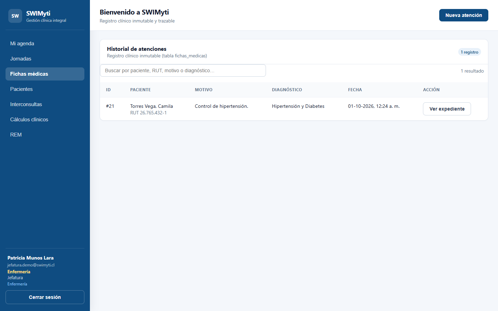
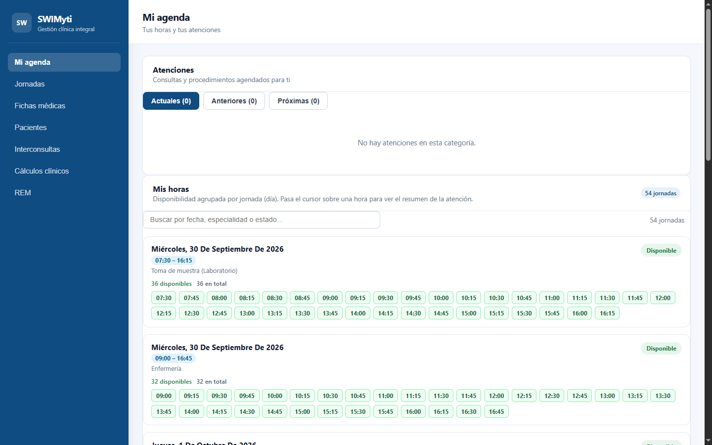
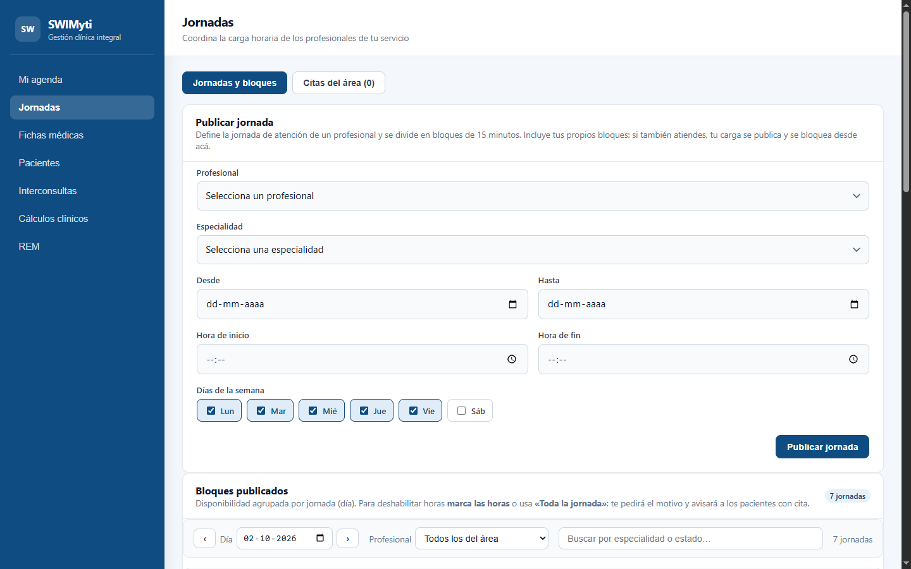
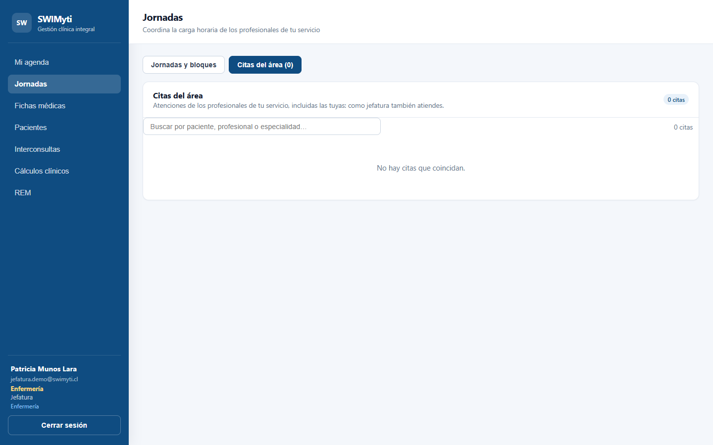
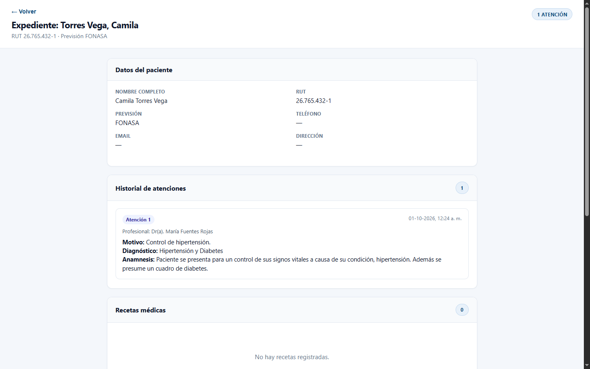
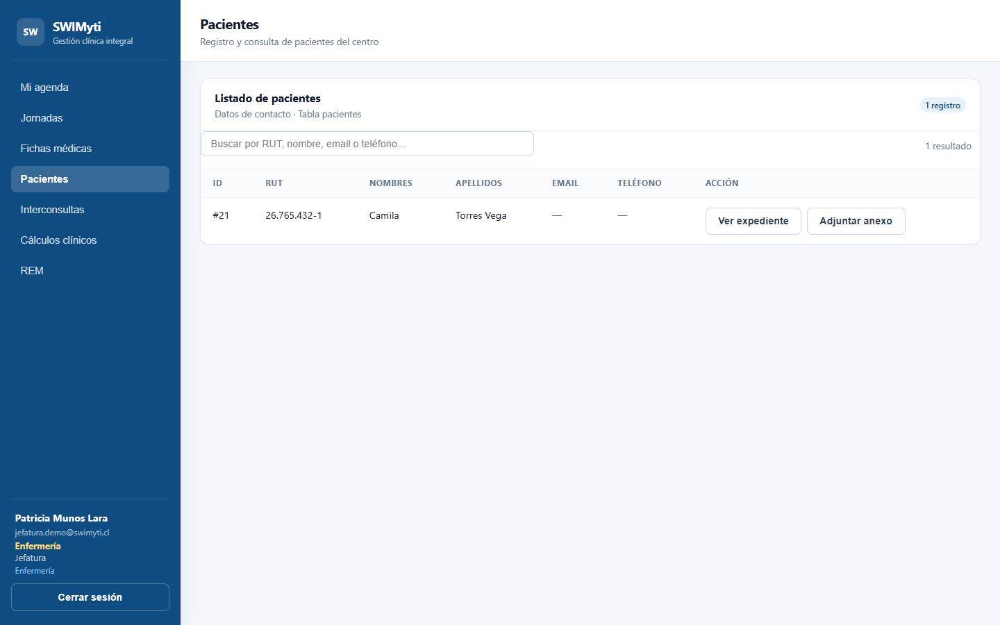

# SWIMyti

**Immutable clinical records SaaS** for low-complexity healthcare centers in Chile.

The core value of the system is not appointment management: it is the **legal traceability of
care** under Chile's **Ley 19.628** (personal data protection law). The clinical record is
*append-only*. It cannot be edited or deleted, and database triggers enforce that at the engine
level — not just in the UI.

**Status:** active development. Database and test suites deployed on Supabase.

Read in [Español](README.md)

---

## Screenshots

Captured from the **production deployment**, with sanitized demo data (RUT `00.000.000-4`,
invalid in the civil registry by construction).

| | |
|---|---|
|  |  |
| **Dashboard** — encounter history and role-gated navigation | **Agenda** — own 15-minute blocks |
|  |  |
| **Jornadas · tab 1** — publish and block blocks | **Jornadas · tab 2** — appointments for the area's professionals |
|  |  |
| **Expediente** — history, prescriptions, certificates, attachments | **Patients** — search by RUT, name or email |

The agenda uses 15-minute blocks derived from shifts, and **a block without a specialty is not
bookable**: every appointment carries patient, specialty and professional.

---

## Stack

| Layer | Technology |
|---|---|
| Frontend | React 19 · React Router 7 · TypeScript (strict) · Vite 8 |
| Backend | Supabase (Postgres · Auth · Storage) |
| Security | Row Level Security + `SECURITY DEFINER` RPCs |
| Styling | Plain CSS per module, no framework |
| Tests | Vitest (frontend) · transactional SQL (database integrity) |
| Lint | oxlint |
| Deploy | Vercel |

---

## Start here

Each item below is a real problem that was solved. They are here because they are the evidence
behind the work.

### 1. The clinical record is immutable by design

`fichas_medicas` and `enmiendas_auditoria` reject `UPDATE` and `DELETE`. This is not a team
convention or a form validation: triggers raise an exception.

```sql
-- supabase/migrations/
-- fn_bloquear_mutacion_inmutable + trg_fichas_medicas_no_delete
```

This answers a legal requirement, not a design preference.

### 2. RLS decides rows; triggers decide columns

Column-level restrictions cannot be expressed in a Postgres policy. The project's pattern is
`fn_proteger_datos_sensibles_paciente`: RUT and insurance status require a specific role, while
`activo` and `id_usuario_portal` are administrator-only.

```sql
fn_proteger_datos_sensibles_paciente()
```

### 3. An encounter requires both an appointment and a voucher

Hard integrity rule: **no encounter exists without a scheduled appointment or without an issued
voucher**, because the agreed flow is `appointment → voucher → encounter → record`.

```sql
-- supabase/migrations/20261002093000_atencion_como_entidad.sql
-- atenciones table + fn_valida_vinculos_atencion() (BEFORE INSERT SECURITY DEFINER)
```

`atenciones` has non-nullable `id_cita` and `id_bono` with `RESTRICT` foreign keys and uniqueness
on both: one appointment cannot produce two encounters, and a voucher cannot be reused.

### 4. A trigger bug that cost a full day

A trigger that **writes to another table** must be `SECURITY DEFINER`. Running as `invoker`, it
executes with the permissions of whoever fired the statement: if that role has no write policy on
the target table, the `UPDATE` affects **zero rows without raising an error**.

```sql
fn_liberar_horario()  -- was invoker: blocks stayed 'reservada' forever
```

The symptom was silent, which is the worst part. The regression is covered in
`supabase/tests/auditoria_rls.sql`.

### 5. The PostgREST trap

PostgREST **does not accept whitespace between two closing parentheses**:

```ts
usuarios:id_profesional(nombres, apellidos) )   // does not parse
usuarios:id_profesional(nombres, apellidos))    // works
```

It broke seven screens at once, because both styles coexisted in the same file and the code looked
consistent. That is why `npm run consultas` exists: it validates **every** frontend query against
the real database, including nested embeds, existing columns and RPC parameters. It exits with code
1 on any mismatch.

```bash
npm run consultas   # requires ADMIN_PASSWORD in the environment
```

### 6. Timezone

The database stores `timestamptz` in UTC. All block generation must anchor to `America/Santiago`.
Historical bug: blocks were being emitted at 04:30 Chile time.

---

## Structure

```
frontend/
  src/
    pages/            21 screens, one per module
    components/       sidebar, calendars, route-level access control
    context/          session + role (single source of role truth on the client)
    services/         Supabase client
    types/            database table types
    utils/            permission helpers (UX, not security)
    styles/           plain CSS per module
supabase/
  migrations/         61 numbered migrations
  tests/              RLS audit + transactional suites
scripts/              real-database query verification
docs/                 functional documentation (Markdown)
```

---

## Verification

```bash
cd frontend
npm install
npm run dev          # development
npm run build        # tsc -b && vite build
npm run test         # vitest
npm run lint         # oxlint
npm run consultas    # validates queries against the real database
```

The SQL suites run against the real database inside transactions that `ROLLBACK`: the test verifies
real RLS and trigger behaviour without leaving a trace.

---

## Access model

Seven roles with cumulative permissions: `administrador`, `administrativo`, `doctor`, `enfermeria`,
`unidad_apoyo`, `jefatura`, `paciente`.

Security lives in **RLS and RPCs**. Frontend route guards are navigation and user experience, never
a security boundary: a user can bypass the interface, but cannot bypass the policies.

Policies are written `TO authenticated` with a deliberate allowlist, never `TO public`.